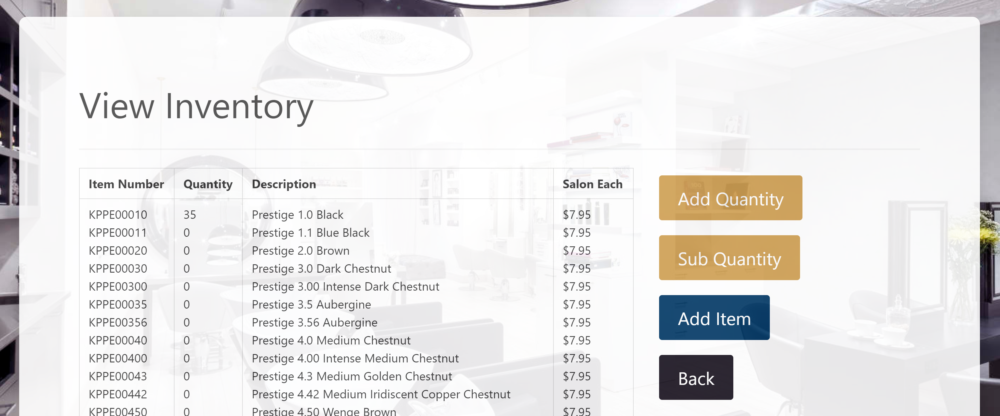
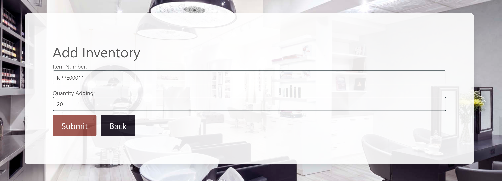

# Inventory Manager for hair salon

This app is designed for a specific hair salon, to help them keep track of products they use for their customers hair appointments.

To use this app, click the heroku link and just click log in. No need to enter an email or password as this has been disabled for demonstration purposes.

This will take you to see the main page. 

From there you can view the inventory, add and subtract inventory.

There are a couple of ways to add or subtract quantities of product from the inventory. From the main menu or from the view inventory page. After you on the add or subtract inventory buttons, it will take you to a screen that looks like the pictures below. You can then enter in an item number and the quantity change.

# Technology Used

- JavaScript
- Node
- React
- MongoDB
- HTML
- Bulma
- CSS
- Heroku
- Passport Authentication (incomplete)
- and more..

# Contributors

- Trevor Burningham
- Kellie Hunsaker
- Curtis Allen
- Stephen Green

